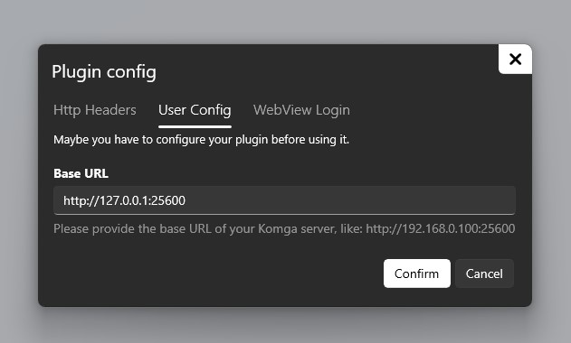
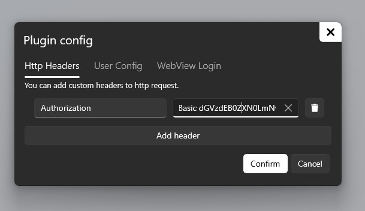

# Komga plugin

This is the Komga plugin for Rulia app.

## Install

1. Download the plugin zip and save it to somewhere.

2. Open Rulia and install it: Just click the "+" button in plugin page then select the zip file. Simple.

3. There would be a Komga icon in plugin list if everything goes well.

## Config

1. You have to tell the plugin where your Komga server is. Right click the plugin icon, hit the setting button in the flyout, then a dialog will pop up, click **User Config** tab and fill the **Base URL** field. For an example, let's say your Komga server is just on your computer, it will be `http://127.0.0.1:25600`.

    

2. You have to add a header named `Authorization` in **Http Headers** tab. Switch to **Http Headers** tab, hit "Add header" button, then:

 - Fill the header field with `Authorization`.

 - Value field is a little bit tricky, it is in the form of `"Basic " + base64("<Your Komga Username>:<Your Komga Password>")`. You can use the following Powershell command to get the result. Let's say your username is `test@test.com` and the password is `test`:

    ```powershell
    [System.Convert]::ToBase64String([System.Text.Encoding]::UTF8.GetBytes("test@test.com:test"))
    ```

    Open Your Powershell, copy and paste the ↑ command, then your prompt will be like ↓:


    ```powershell
    PS C:\Users\Tom> [System.Convert]::ToBase64String([System.Text.Encoding]::UTF8.GetBytes("test@test.com:test"))
    dGVzdEB0ZXN0LmNvbTp0ZXN0
    ```

    The output `dGVzdEB0ZXN0LmNvbTp0ZXN0` is what we want, then fill the following text into the value field in Rulia:

    ```
    Basic dGVzdEB0ZXN0LmNvbTp0ZXN0
    ```
    
    


    Now everything is ready if it goes well.
